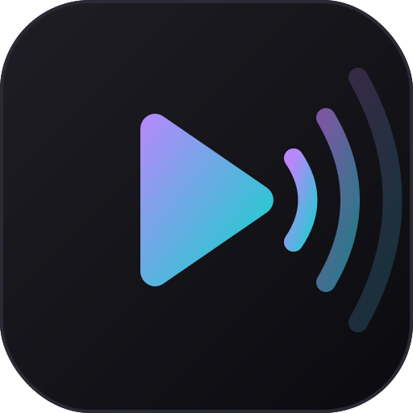

<div align="center">
  
  <h1>Vibestreamer</h1>
  <p>Modern, feature-rich IPTV player built with <strong>C++17 · Qt6 · libmpv</strong></p>

  
  
  
  
</div>

---

## Features

- **Xtream Codes API** — Live TV, VOD, and Series with category browsing
- **M3U / M3U8 Playlist** — Local or remote playlists, background parsing
- **EPG (Electronic Program Guide)** — XMLTV-based, real-time program info overlay with progress bar
- **libmpv Playback** — Hardware-accelerated decoding via OpenGL render context
- **Picture-in-Picture** — Floating, draggable/resizable mini-player overlay
- **Multi-View (2×2)** — Inline split-screen: player area divides into four cells; click any cell to make it active, double-click a channel to stream into it
- **Favorites** — Persistent channel bookmarking with dedicated filter view
- **Stream Recording** — Direct stream capture via mpv with pause/resume/stop and segmented output
- **Dark / Light Theme** — Full dynamic theme switching, no restart required
- **Accent Color** — Fully customizable UI accent color
- **Instant Search & Filter** — Real-time channel search using `QSortFilterProxyModel`, with search history autocomplete
- **State Persistence** — Resumes last played channel, volume, source, and category on startup
- **Auto-Update** — Configurable per-source refresh interval (hourly to weekly)
- **Persistent Logo Cache** — Channel logos cached to disk (MD5-keyed PNGs) to avoid redundant network fetches
- **7-Language UI** — English, Turkish, German, Italian, French, Portuguese, Arabic
- **System Tray** — Minimize to tray with mute/unmute context menu
- **Fully Configurable Shortcuts** — Rebind every key action from Settings

---

## Screenshots

> Launch the app and use Settings → Appearance to switch between Dark and Light themes.

---

## Getting Started

### Dependencies

#### Linux (Arch / Manjaro)
```bash
sudo pacman -S mpv qt6-base qt6-opengl cmake
```

#### Linux (Ubuntu / Debian)
```bash
sudo apt install libmpv-dev qt6-base-dev libqt6opengl6-dev \
     libqt6svg6-dev libqt6xml6 cmake build-essential
```

#### macOS (Homebrew)
```bash
brew install mpv qt cmake
```

#### Windows
1. [Qt6 SDK](https://www.qt.io/download)
2. [libmpv](https://sourceforge.net/projects/mpv-player-windows/files/libmpv/) — extract and set `MPV_DIR`
3. [CMake](https://cmake.org/download/)

---

### Build

#### Linux / macOS
```bash
git clone https://github.com/krmmyvz/vibestreamer.git
cd vibestreamer
cmake -B build -DCMAKE_BUILD_TYPE=Release
cmake --build build -j$(nproc)
./build/Vibestreamer
```

#### Windows (MSVC)
```cmd
cmake -B build -DCMAKE_BUILD_TYPE=Release -DMPV_DIR=C:\path\to\mpv-dev
cmake --build build --config Release
.\build\Release\Vibestreamer.exe
```

---

## Keyboard Shortcuts

All shortcuts are rebindable in Settings → Shortcuts.

| Key | Action |
|-----|--------|
| `Space` | Play / Pause |
| `F11` / Double-click | Toggle fullscreen |
| `←` / `→` | Seek ±10 seconds |
| `↑` / `↓` | Volume ±5 |
| `M` | Toggle mute |
| `F` | Toggle favorite |
| `N` / `P` | Next / Previous channel |
| `A` | Select audio track |
| `S` | Select subtitle |
| `I` | Show media info |
| `Esc` | Exit fullscreen / PiP |

---

## Configuration

Config is stored at `~/.config/Vibestreamer/config.json` and includes:

| Field | Description |
|-------|-------------|
| `sources` | Xtream Codes or M3U source definitions |
| `favorites` | Bookmarked channel list |
| `theme_mode` | `0` = Dark, `1` = Light |
| `accent_color` | Hex color for UI highlights (default `#BB86FC`) |
| `language` | `en` · `tr` · `de` · `it` · `fr` · `pt` · `ar` |
| `state_persistence` | Resume last channel/source/volume on startup |
| `volume` | Last volume level (0–200) |
| `shortcuts` | Key binding map |
| `mpv_hw_decode` | Hardware decode mode passed to libmpv |
| `mpv_extra_args` | Additional whitelisted libmpv property overrides |
| `record_path` | Directory for recorded streams |
| `minimize_to_tray` | Send to system tray on window close |

---

## Project Structure

```
vibestreamer/
├── CMakeLists.txt
├── logo_concept1.svg
├── resources.qrc
├── translations/
│   ├── en.json · tr.json · de.json
│   ├── it.json · fr.json · pt.json · ar.json
└── src/
    ├── main.cpp                    — Entry point, app metadata
    ├── core/
    │   ├── models.h                — Data models (Source, Category, Channel, EpgProgram)
    │   └── config.h/cpp            — JSON config persistence (~/.config/Vibestreamer/)
    ├── network/
    │   ├── xtreamclient.h/cpp      — Async Xtream Codes API client (QUrlQuery-safe)
    │   └── imagecache.h/cpp        — Async logo cache with persistent disk storage
    ├── parser/
    │   ├── m3uparser.h/cpp         — M3U/M3U8 playlist parser (background thread)
    │   └── epgmanager.h/cpp        — XMLTV EPG parser with background merge/sort
    ├── media/
    │   └── mpvwidget.h/cpp         — libmpv QOpenGLWidget renderer
    ├── i18n/
    │   └── localization.h          — I18n singleton, JSON-driven translations
    └── ui/
        ├── styles/
        │   ├── theme.h             — Design token system (dark/light palettes + QSS)
        │   └── icons.h             — SVG icon factory with dynamic tinting
        ├── dialogs/
        │   ├── sourcedialog.h/cpp  — Add / edit source dialog
        │   ├── settingsdialog.h/cpp — Preferences dialog (shortcuts tab)
        │   └── multiviewdialog.h/cpp — Standalone 2×2 multi-view dialog
        ├── widgets/
        │   └── multiviewwidget.h/cpp — Inline 2×2 split-screen widget
        ├── mainwindow.h
        ├── mainwindow.cpp              — Constructor, core helpers, event handlers
        ├── mainwindow_setup.cpp        — UI construction (sidebar, player, control bar, tray)
        ├── mainwindow_theme.cpp        — Theme application and inline style updates
        ├── mainwindow_navigation.cpp   — Source/category/channel loading, search, playback routing
        ├── mainwindow_controls.cpp     — Playback controls, volume, speed, track menus
        ├── mainwindow_epg.cpp          — EPG panel, program info, favorites
        ├── mainwindow_recording.cpp    — Stream recording (start/pause/stop)
        ├── mainwindow_multiview.cpp    — Multi-view mode and fullscreen toggle
        └── mainwindow_pip.cpp          — Picture-in-Picture mode, drag/resize event filter
```

---

## Security

v1.3.1 includes a full security hardening pass:

- **MPV property injection** — `mpv_extra_args` validated against an explicit whitelist of safe properties
- **URL scheme enforcement** — All network clients (Xtream, EPG, M3U, image cache) reject non-`http(s)` schemes
- **Query injection prevention** — Category and stream IDs encoded via `QUrlQuery` instead of string concatenation
- **Download size limits** — M3U capped at 100 MB, EPG at 200 MB, channel logos at 2 MB per file
- **Config bounds** — All numeric config values clamped with `qBound` on load
- **Credential-free persistence** — Stream URLs (which embed Xtream credentials) are never written to disk; `lastChannelId` + `lastChannelSourceId` are stored instead
- **Recording path** — Output directory validated to be within the user's home directory
- **Reserved filename guard** — Windows reserved names (CON, NUL, COM1–9, LPT1–9) replaced in recording filenames

---

## License

MIT License © 2025 [krmmyvz](https://github.com/krmmyvz)
